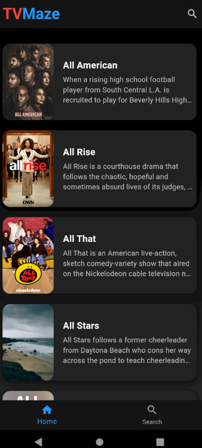

<<<<<<< HEAD
# TV Maze Movies App

A new Flutter project displaying movies from the TVMaze API.

## Getting Started

### Screenshots

#### Home Screen


#### Details Screen


#### Search Screen


---

## Installation

### Prerequisites

- [Flutter](https://flutter.dev/docs/get-started/install)
- [Dart](https://dart.dev/get-dart)

### Steps
pubspec.yaml: add http from pub.dev

1. Clone the repository:
    ```sh
    git clone https://github.com/prayasjadaun/TV_Maze_Movies_App
    ```
2. Navigate to the project directory:
    ```sh
    cd tv_maze_movies_app
    ```
3. Install dependencies:
    ```sh
    flutter pub get
    ```
4. Run the app:
    ```sh
    flutter run
    ```

---
=======
# tv_maze_movies_app

A new Flutter project.

## Getting Started

This project is a starting point for a Flutter application.

A few resources to get you started if this is your first Flutter project:

- [Lab: Write your first Flutter app](https://docs.flutter.dev/get-started/codelab)
- [Cookbook: Useful Flutter samples](https://docs.flutter.dev/cookbook)

For help getting started with Flutter development, view the
[online documentation](https://docs.flutter.dev/), which offers tutorials,
samples, guidance on mobile development, and a full API reference.
>>>>>>> 2d7d3a5 (Changes AppBar fonts)
